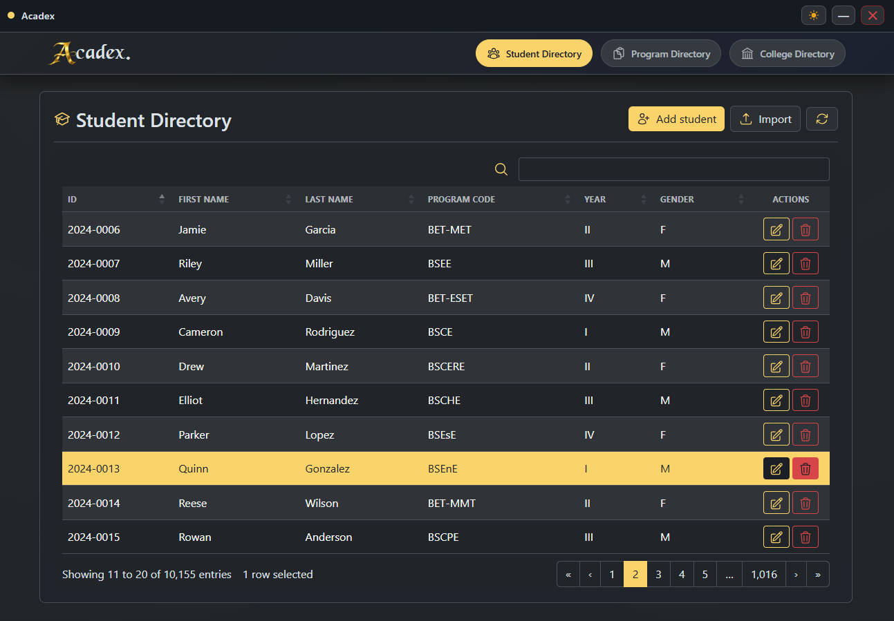

<div align="center">
    <picture>
    <source srcset="docs/logo_dark.png" media="(prefers-color-scheme: dark)">
    <source srcset="docs/logo_light.png" media="(prefers-color-scheme: light)">
    
    </picture>
</div>

<p align="center">
  
  
  
  
  
  
</p>

A lightweight desktop application for managing academic directory records — Students, Programs, and Colleges — powered by React + Tauri.

<div align="center">



</div>

---

## 📋 Overview

Acadex is a desktop app built with React, Vite, and Tauri with a Bootstrap 5 UI. It provides full CRUD operations across three linked directories with fast, searchable, and sortable tables.

---

## 🧾 Data Model

### 👤 Students

| Column | Type | Constraints | Description |
|---|---|---|---|
| `ID` | String | Primary Key, Required | Unique student identifier |
| `First Name` | String | Required | Student's first name |
| `Last Name` | String | Required | Student's last name |
| `Program Code` | String | FK → Programs.Code, nullable (`NULL`) | Enrolled program |
| `Year` | String | Required | Year level (e.g., `1`, `2`, `3`, `4`) |
| `Gender` | String | Required | Gender (e.g., `Male`, `Female`) |

---

### 📄 Programs

| Column | Type | Constraints | Description |
|---|---|---|---|
| `Code` | String | Primary Key, Required | Unique program code (e.g., `BSCS`) |
| `Name` | String | Required | Full program name |
| `College` | String | FK → Colleges.Code, nullable (`NULL`) | Parent college |

---

### 🏛️ Colleges

| Column | Type | Constraints | Description |
|---|---|---|---|
| `Code` | String | Primary Key, Required | Unique college code (e.g., `CCS`) |
| `Name` | String | Required | Full college name |

---

## 🚀 Getting Started

### ✅ Prerequisites

| Requirement | Notes |
|---|---|
| [Node.js](https://nodejs.org/) 18+ | Required for the frontend and Tauri CLI |
| [Rust](https://www.rust-lang.org/tools/install) | Required to build and run the Tauri backend |
| [Tauri prerequisites](https://tauri.app/start/prerequisites/) | Install OS-level dependencies for your platform |

### ▶️ Run in Development

```bash
# Clone the repository
git clone <repo-url>
cd acadexv2

# Install dependencies
npm install

# Start the Tauri app in development mode
npm run tauri dev
```

The app window will open automatically.

### 📦 Build for Production

```bash
# Build the desktop app for the current platform
npm run tauri build
```

For platform-specific packaging details, refer to the [Tauri build documentation](https://tauri.app/distribute/).